# 🌐 Web Application Firewall

> Professional project by Gabriel Demetrios Lafis

[](https://img.shields.io/badge/)
[](https://img.shields.io/badge/)
[](https://img.shields.io/badge/)
[](https://img.shields.io/badge/)
[](LICENSE)

[English](#english) | [Português](#português)

---

## English

### 🎯 Overview

**Web Application Firewall** is a production-grade R application complemented by CSS, HTML, JavaScript, Python that showcases modern software engineering practices including clean architecture, comprehensive testing, containerized deployment, and CI/CD readiness.

The codebase comprises **537 lines** of source code organized across **5 modules**, following industry best practices for maintainability, scalability, and code quality.

### ✨ Key Features

- **📐 Clean Architecture**: Modular design with clear separation of concerns
- **🧪 Test Coverage**: Unit and integration tests for reliability
- **📚 Documentation**: Comprehensive inline documentation and examples
- **🔧 Configuration**: Environment-based configuration management

### 🏗️ Architecture

```mermaid
graph TB
    subgraph Client["🖥️ Client Layer"]
        A[Web Client]
        B[API Documentation]
    end
    
    subgraph API["⚡ API Layer"]
        C[Middleware Pipeline]
        D[Route Handlers]
        E[Business Logic]
    end
    
    subgraph Data["💾 Data Layer"]
        F[(Primary Database)]
        G[Cache]
    end
    
    A --> C
    B --> C
    C --> D --> E
    E --> F
    E --> G
    
    style Client fill:#e1f5fe
    style API fill:#f3e5f5
    style Data fill:#fff3e0
```



### 🚀 Quick Start

#### Prerequisites

- R 4.3+
- RStudio (recommended)

#### Installation

```bash
# Clone the repository
git clone https://github.com/galafis/Web-Application-Firewall.git
cd Web-Application-Firewall
```

```r
# In R console — install dependencies
install.packages(c("tidyverse", "shiny", "ggplot2", "forecast"))
```

#### Running

```r
source("main.R")
# Or for Shiny apps:
shiny::runApp()
```

### 📁 Project Structure

```
Web-Application-Firewall/
├── tests/         # Test suite
│   └── test_main.R
├── LICENSE
├── README.md
├── analytics.R
├── app.js
├── app.py
└── requirements.txt
```

### 🛠️ Tech Stack

| Technology | Description | Role |
|------------|-------------|------|
| **R** | Core Language | Primary |
| **Flask** | Lightweight web framework | Framework |
| **NumPy** | Numerical computing | Framework |
| **Pandas** | Data manipulation library | Framework |
| JavaScript | 1 files | Supporting |
| Python | 1 files | Supporting |
| HTML | 1 files | Supporting |
| CSS | 1 files | Supporting |

### 🤝 Contributing

Contributions are welcome! Please feel free to submit a Pull Request. For major changes, please open an issue first to discuss what you would like to change.

1. Fork the project
2. Create your feature branch (`git checkout -b feature/AmazingFeature`)
3. Commit your changes (`git commit -m 'Add some AmazingFeature'`)
4. Push to the branch (`git push origin feature/AmazingFeature`)
5. Open a Pull Request

### 📄 License

This project is licensed under the MIT License - see the [LICENSE](LICENSE) file for details.

### 👤 Author

**Gabriel Demetrios Lafis**
- GitHub: [@galafis](https://github.com/galafis)
- LinkedIn: [Gabriel Demetrios Lafis](https://linkedin.com/in/gabriel-demetrios-lafis)

---

## Português

### 🎯 Visão Geral

**Web Application Firewall** é uma aplicação R de nível profissional, complementada por CSS, HTML, JavaScript, Python que demonstra práticas modernas de engenharia de software, incluindo arquitetura limpa, testes abrangentes, implantação containerizada e prontidão para CI/CD.

A base de código compreende **537 linhas** de código-fonte organizadas em **5 módulos**, seguindo as melhores práticas do setor para manutenibilidade, escalabilidade e qualidade de código.

### ✨ Funcionalidades Principais

- **📐 Clean Architecture**: Modular design with clear separation of concerns
- **🧪 Test Coverage**: Unit and integration tests for reliability
- **📚 Documentation**: Comprehensive inline documentation and examples
- **🔧 Configuration**: Environment-based configuration management

### 🏗️ Arquitetura


### 🚀 Início Rápido

#### Prerequisites

- R 4.3+
- RStudio (recommended)

#### Installation

```bash
# Clone the repository
git clone https://github.com/galafis/Web-Application-Firewall.git
cd Web-Application-Firewall
```

```r
# In R console — install dependencies
install.packages(c("tidyverse", "shiny", "ggplot2", "forecast"))
```

#### Running

```r
source("main.R")
# Or for Shiny apps:
shiny::runApp()
```

### 📁 Estrutura do Projeto

```
Web-Application-Firewall/
├── tests/         # Test suite
│   └── test_main.R
├── LICENSE
├── README.md
├── analytics.R
├── app.js
├── app.py
└── requirements.txt
```

### 🛠️ Stack Tecnológica

| Tecnologia | Descrição | Papel |
|------------|-----------|-------|
| **R** | Core Language | Primary |
| **Flask** | Lightweight web framework | Framework |
| **NumPy** | Numerical computing | Framework |
| **Pandas** | Data manipulation library | Framework |
| JavaScript | 1 files | Supporting |
| Python | 1 files | Supporting |
| HTML | 1 files | Supporting |
| CSS | 1 files | Supporting |

### 🤝 Contribuindo

Contribuições são bem-vindas! Sinta-se à vontade para enviar um Pull Request.

### 📄 Licença

Este projeto está licenciado sob a Licença MIT - veja o arquivo [LICENSE](LICENSE) para detalhes.

### 👤 Autor

**Gabriel Demetrios Lafis**
- GitHub: [@galafis](https://github.com/galafis)
- LinkedIn: [Gabriel Demetrios Lafis](https://linkedin.com/in/gabriel-demetrios-lafis)
